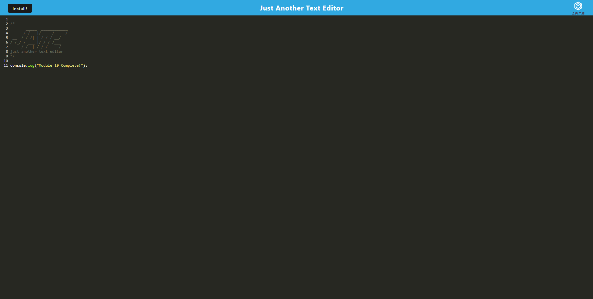

# Just Another Text Editor - Progressuve Web Applications (PWA) - Module 19

## Table of Contents
1. [Description](#description)
2. [Link](#link)
3. [Usage](#usage)
4. [Technologies](#technologies)
5. [Visuals](#visuals)

## Description
This is a Progressive Web App, or PWA, which is a website that can also be downloaded onto a users computer. This app was created as a text editor that includes coding syntax highlighting that is mixed in.

## Link
[Link to Heroku Site](https://tedstexteditor.herokuapp.com/)

## Usage
In order to use this application you can simply go to the heroku app provided. In the deployed heroku application you may download the app for local or offline use. Another option to using this application would be to clone the entire project into a folder. From there you want to go into the cloned repository and follow the scripts in the package.json to get the server and website fully up and running. Once you have gone through the script you can run npm start and run the server in your browser at "http://localhost:3000/".

## Technologies
The Technologies used in this application are - Node.js, Express, Webpack, Babel and Code Mirror.

## Visuals
